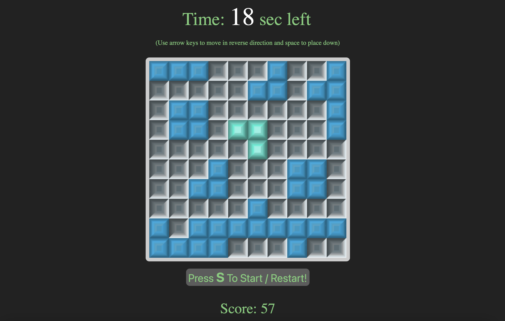

# ⏳ BlocksOfTime  
[Play the game here](https://christineyiyunhu.github.io/BlocksOfTime.github.io/)

## Overview  
**BlocksOfTime** is a fast-paced, minimalist web puzzle game where players must clear rows and columns using inverted controls—challenging both your reflexes and spatial thinking. The game explores the tension between intention and control under time pressure.

## 🎮 How to Play  
- Press **`S`** to start the game.
- A **shape** will appear on the grid.
- Use the **arrow keys** to move the shape, but with a twist:  
  - Press **⬅️ Right Arrow** to move left  
  - Press **➡️ Left Arrow** to move right  
  - Press **⬆️ Down Arrow** to move up  
  - Press **⬇️ Up Arrow** to move down
- Press **`Space`** to place the shape on the grid.
- Complete a **row or column** to clear it and gain points.
- Your goal: **score 128 points or more within 60 seconds**.

## ✨ Features  
- Inverted control mechanic for a fun cognitive twist  
- Real-time score tracking  
- Beat-the-clock gameplay with a 60-second timer  
- Clean, retro-inspired visual style  
- Built with **HTML**, **CSS**, and **JavaScript**

## 🎯 Objective  
Clear rows and columns by strategically placing shapes.  
Reach **128 points** before the **1-minute timer** runs out to win!

## 🕹️ Try It Now  
🔗 [https://christineyiyunhu.github.io/BlocksOfTime.github.io/](https://christineyiyunhu.github.io/BlocksOfTime.github.io/)

## 👩‍💻 Developer  
Created by **Christine Yiyun Hu**

## 📄 License  
This project is open for learning and personal use.  
Feel free to fork or remix, but please give credit!

